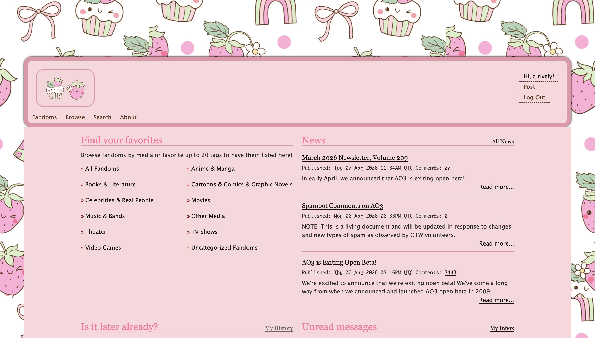

# AO3 Skins by airively

ao3 skins that I've made

---

## Skins

### 🐰 Purple Bunny

### 🍓 Strawberry

---

## How to Use

1. Go to **AO3** → log in
2. Click your username → **My Dashboard**
3. Go to **Skins** → **Create Site Skin**
4. Give it a unique name (e.g. "Purple Bunny by [your username]")
5. Copy and paste the **CSS** code from this repository into the **CSS box**
6. Click **Submit**
7. Click **Use** on the **My Site Skins**

---

## Credits

- Base skin structure inspired by [sorakissed](https://github.com/sorakissed)
- Backgrounds and icons are from Canva
- Flat button style referenced from public AO3 skin resources

---

## Contact

- Tumblr: [kzhas](https://www.tumblr.com/kzhas)
- AO3: [airively](https://archiveofourown.org/users/airively)
- Twitter: [airiively](https://x.com/airiively)
