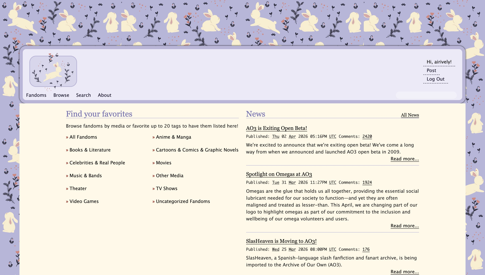

# AO3 Skins by airively

ao3 skins that I've made

---

## Preview

<!-- Add screenshots of your skins here -->

---

## Skins

### 🐰 Purple Bunny

A soft blue-grey lavender skin with a bunny pattern background and cream accents.

---

## How to Use

1. Go to **AO3** → log in
2. Click your username → **Preferences**
3. Go to **Skins** → **Create Site Skin**
4. Give it a name (e.g. "Purple Bunny")
5. Paste the CSS code from this repository into the CSS box
6. Click **Submit**
7. Go back to **Preferences** → select your new skin → **Save**

---

## Credits

- Base skin structure inspired by [sorakissed](https://github.com/sorakissed)
- Bunny background image: original art (please do not reuse)
- Flat button style referenced from public AO3 skin resources

---

## Contact

- Tumblr: [kzhas]
- AO3: [airively]
- Twitter: [airiively]
